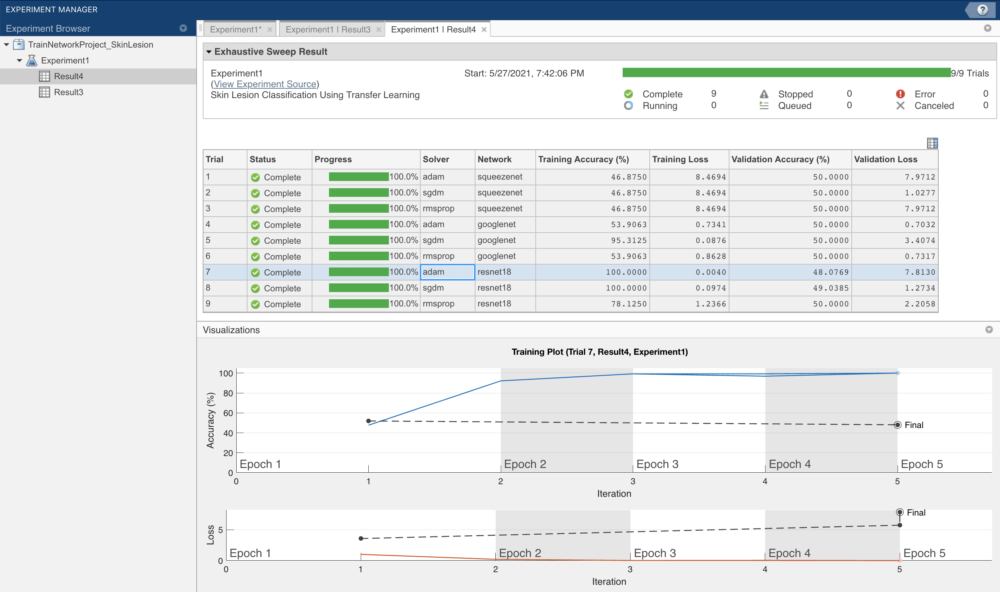

# Managing medical image classification experiments with MATLAB Experiment Manager App
This repository shows an example of how to use MATLAB Experiment Manager for a medical image classification task.

## Experiment objective
To test the best combination of pretrained deep learning model and optimizer for a binary (*malignant* or *benign*) skin lesion classification task using transfer learning.

## Common components
### Dataset
Annotated images[1](#myfootnote1) from the [ISIC 2016](https://challenge.isic-archive.com/data) challenge, Task 3 (Lesion classification) dataset, consisting of 900 dermoscopic lesion images in JPEG format for training and validation, distributed in two classes (727 images were labeled as ‘benign’, 173 as ‘malignant’) plus 379 test images of the exact same format as the training data, and associated ground truth for all images.

### Common hyperparameters
- Dataset partition (e.g., 70% for training, 30% for validation)
- Loss function
- Mini-batch size
- Initial learning rate
- Learning rate schedule
- Number of epochs
- Validation patience
- Validation frequency
- Performance metrics
  
### Preprocessing scripts
- Image resizing (to the size expected by the input layer of each model)
- Image augmentation (e.g., translation, scaling and rotation)

## Variable sets
A total of nine (3 x 3) combinations of:
- Model: ResNet-18, GoogLeNet or SqueezeNet
- Optimizer: ‘adam’, ‘sgdm’, or ‘rmsprop’

## Requirements
- [X]  [MATLAB 2020a](https://www.mathworks.com/products/matlab.html) or later
- [X]  [Deep Learning Toolbox](https://www.mathworks.com/products/deep-learning.html)
- [X]  [Deep Learning Toolbox™ Model for GoogLeNet Network support package](https://www.mathworks.com/help/deeplearning/ref/googlenet.html) 
- [X]  [Deep Learning Toolbox™ Model for ResNet-18 Network support package](https://www.mathworks.com/help/deeplearning/ref/resnet18.html) 
- [X]  [Deep Learning Toolbox™ Model for SqueezeNet Network support package](https://www.mathworks.com/help/deeplearning/ref/squeezenet.html) 
- [ ]  [Parallel Computing Toolbox](https://www.mathworks.com/products/parallel-computing.html) (only required for training using a GPU)
## Suggested steps
1. Download or clone the repository.
2. Open MATLAB.
3. Edit the `ExperimentSetup.mlx` file to reflect the path to your selected dataset. 
4. Open the Experiment Manager app [2] (you can type `experimentmanager` in the MATLAB Command Window).
5. Select ... option.
6. Select ...
7. Configure ... (see figure below).
8. ...
9.   with a trained image classification network. This network has been trained using transfer learning with the GoogLeNet pretrained network.

## Additional remarks
- You are encouraged to expand and adapt the example to your needs.
- ...

## Notes
<a name="myfootnote1">[1]</a> This example uses a small subset of images to make it easier to get started without having to worry about large downloads and long training times.   

[2] [Experiment Manager App](https://www.mathworks.com/help/deeplearning/ref/experimentmanager-app.html)

[3] ...

[4] ... 

[5] ...